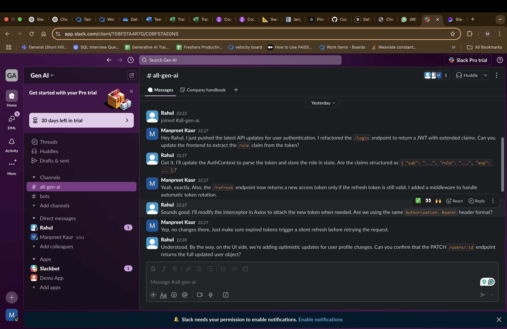
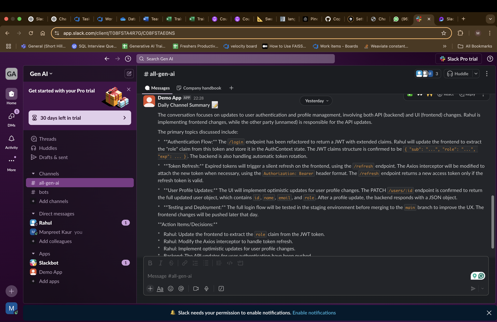

# Slack Bot

## Overview
This Slack bot integrates with Slack workspaces to provide automated responses, message processing,and generating summaries. It supports real-time summarization using summary chains and enables easy onboarding for new developers by indexing project documentation, chats, GitHub repositories, emails, and tickets. 

## Features
- **Event-Driven Architecture**: Listens to Slack messages, commands, and other workspace events.
- **Real-Time Summarization**: Generates summaries when `@summary` is mentioned in a Slack channel.
- **Context Length Handling**: Uses summary chains to manage long conversations.

## Setup Instructions

### 1. Prerequisites
- Python 3.x installed
- A Slack workspace and bot user configured
- A Slack API token
- OpenAI API key (for summarization and RAG features)
- GitHub access (if integrating with repositories)
- Storage solution for embeddings (FAISS, Weaviate, or similar)

### 2. Clone the Repository
```bash
git clone https://github.com/ManpreetShorthillsAI/slackbot.git
cd slackbot
```

### 3. Install Dependencies
```bash
pip install -r requirements.txt
```

### 4. Set Up Environment Variables
Create a `.env` file in the project root and add:
```env
SLACK_BOT_TOKEN=<your_slack_token>
SLACK_APP_TOKEN=<your_slack_app_token>
OPENAI_API_KEY=<your_openai_api_key>
GITHUB_ACCESS_TOKEN=<your_github_token>
EMAIL_API_KEY=<your_email_api_key>
```

### 5. Run the Bot
```bash
python3 main.py
```


## Screenshots

